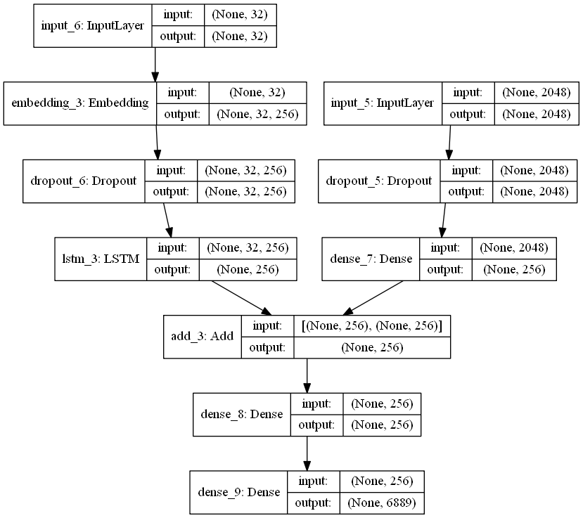

# Image_Captioning_Keras
You saw an image and your brain can easily tell what the image is about, but can a computer tell what the image is representing? Computer vision researchers worked on this a lot and they considered it impossible until now! With the advancement in Deep learning techniques, availability of huge datasets and computer power, we can build models that can generate captions for an image.
  
I used deep learning techniques of Convolutional Neural Networks and a type of Recurrent Neural Network (LSTM) in this project.
Image caption generator is a task that involves computer vision and natural language processing concepts to recognize the context of an image and describe them in a natural language like English.

 
I implemented the caption generator using CNN (Convolutional Neural Networks) and LSTM (Long short term memory). The image features will be extracted from Xception which is a CNN model trained on the imagenet dataset and then we feed the features into the LSTM model which will be responsible for generating the image captions.

 
 

# Model Architecture

 

# Running the Model
(i) Clone the repository  
(ii) Download <a href="https://github.com/jbrownlee/Datasets/releases/download/Flickr8k/Flickr8k_Dataset.zip">Flicke8k dataset<a> from here.
It contains images for the captioning.  
(iii) Download <a href="https://github.com/jbrownlee/Datasets/releases/download/Flickr8k/Flickr8k_text.zip">Flickr_8k_text<a>. That contains captions for the related images.
It has 5 captions per image. 
(iv) Run the Testing.ipynb file.
